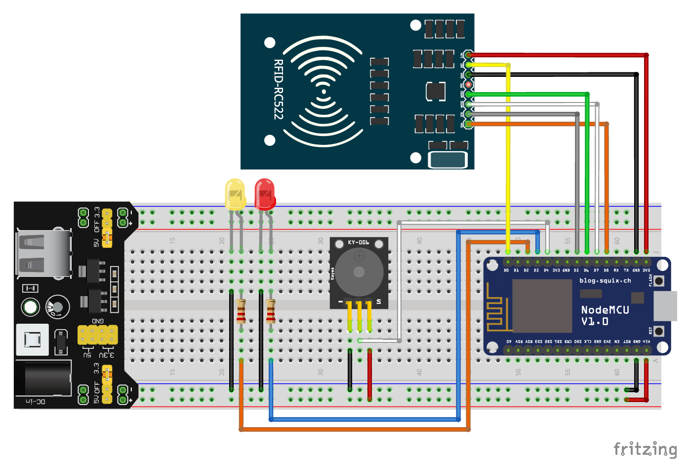

# BusCheck - Collector

## Descrição do Projeto

Projeto de IoT, módulo eletrônico para leitura de tags RFID, integrado ao sistema de controle de rotas universitárias [BusCheck](https://github.com/geofmoura/BusCheck).

Este é um projeto de eletrônica que utiliza um módulo ESP8266 como controlador principal, permitindo comunicação via Wi-Fi. Conectado ao ESP estão um módulo de leitura e escrita RFID e um módulo buzzer passivo.

O ESP conecta-se a um servidor MQTT para compartilhar os dados. Sempre que uma tag RFID é lida, o ESP publica as informações no canal `sensor/<codigo-do-veiculo>/rfid`.

O projeto também inclui um worker escrito em Python que ouve o canal e salva as leituras no banco de dados do projeto [BusCheck](https://github.com/geofmoura/BusCheck).

O projeto será desenvolvido por uma equipe de 5 pessoas.

## Arquitetura do Sistema

## Esquema Elétrico

## Requisitos Funcionais

### RF01 - Leitura de Tags RFID
- O sistema deve ser capaz de ler tags RFID compatíveis com o módulo RFID-RC522
- Cada leitura deve capturar o UID único da tag
- O sistema deve registrar o timestamp da leitura com precisão de segundos

### RF02 - Comunicação Wi-Fi
- O módulo ESP8266 deve conectar-se a redes Wi-Fi configuradas
- Deve suportar reconexão automática em caso de perda de conexão

### RF03 - Publicação MQTT
- O sistema deve publicar leituras RFID no tópico `sensor/<codigo-do-veiculo>/rfid`
- Cada mensagem deve conter:
  - UID da tag RFID
  - Código do veículo

### RF04 - Processamento de Leituras (Worker Python)
- O worker deve assinar o tópico MQTT `sensor/+/rfid`
- Deve processar mensagens recebidas e validar seu formato
- Deve persistir leituras válidas no banco de dados do BusCheck

### RF05 - Feedback Sonoro
- O sistema deve emitir um sinal sonoro via buzzer após leitura bem-sucedida

## Etapas do Projeto

1. **Desenvolvimento do projeto de eletrônica**
   - Esquemático do circuito
   - Montagem do protótipo

2. **Desenvolvimento do firmware do ESP8266**
   - Implementação da leitura RFID
   - Integração com Wi-Fi e MQTT
   - Feedback sonoro

3. **Configuração do servidor MQTT**
   - Instalação e configuração do broker MQTT

4. **Desenvolvimento do worker em Python**
   - Assinatura de tópicos MQTT
   - Processamento e validação de mensagens
   - Persistência no banco de dados
   - Sistema de logs

6. **Documentação**
   - Relatório final do projeto

## Tecnologias Utilizadas

- **Hardware**: ESP8266, Módulo RFID RFID-RC522, Buzzer passivo
- **Firmware**: Arduino Framework (C++)
- **Comunicação**: Wi-Fi, Protocolo MQTT
- **Backend**: Python 3.x, Biblioteca Paho MQTT
- **Banco de Dados**: PostgreSQL (Supabase)
- **Broker MQTT**: Mosquitto
